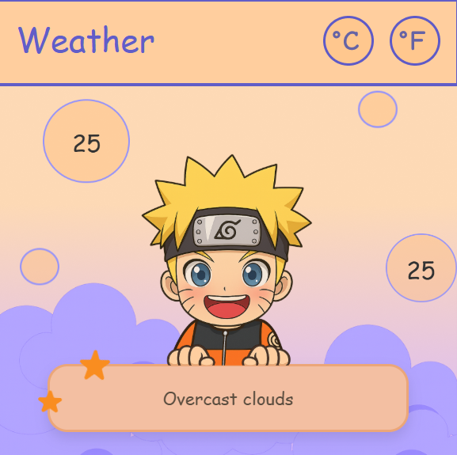
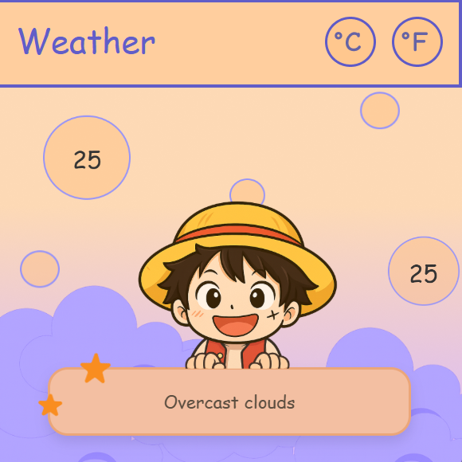

# 🌤️ Bubble Weather App

A cute and aesthetic desktop weather app built with Electron.js, featuring animated Luffy, floating bubbles, and real-time weather updates.

## ✨ Features
- 🍥 Animated Luffy and Naruto character (frame-by-frame animation)
- 🌡️ Real-time weather using WeatherAPI
- 🔁 Celsius ↔ Fahrenheit toggle
- 🫧 Floating animated bubble UI
- 🖥️ Desktop app built with Electron.js
- 🎨 Soft pastel aesthetic design

## 🛠️ Tech Stack
- HTML, CSS, JavaScript
- Electron.js
- WeatherAPI

## 📸 Preview

 

## 🚀 Run Locally
```bash
npm install
npm start


